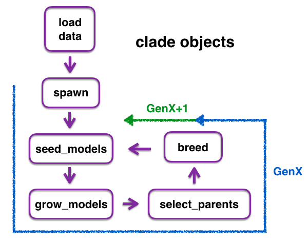

DeepLearnGene for Python
=================================

Package written in Python 3.6.0, using Keras version 2.0.1 with a
Tensflow (version 1.0.0) backend

Author: Lukmaan A. Bawazer

Overview
--------
This package optimizes deep learning model architectures via genetic programming. Currently only simple fully connected architectures are supported, with plans to extend the package to RNN and CNN architectures in the near future.

In addition to the notes below, a step-by-step introduction is provided in the Demos (ADD LINK) folder.

#### Usage Notes ####
Currently the package is set up to be run interactively (e.g., from an Jupyter notebook), using [sacred](http://sacred.readthedocs.io/en/latest/quickstart.html) as a tool to edit a default config dictionary which defines parameters for an experiment. (In the future an automated evolution option will be added, whereby diversification, selection, and breed occur automatically across a specified number of model generations.)

The default config dictionary values are defined in environment.py. These
values specify hyperparameter ranges that are sampled to build a population of fully connected Tensorflow architectures, which are built using Keras. Each model in a population is trained and evaluated, and high-performing (and some random) sub-sets of models are selected as 'parents' to generate a new population of models based on the parameters of the selected parents. These operations are performed via
a clade object, and can be iterated to conduct multiple generations of model evolution via the object. However, it is not necessary to use the same clade object for all steps in the evolution. Outputs of functions are saved as either serialized models (.h5 files) or pickled dataframes. If desired or useful, outputs from a function (e.g., dataframes with model test performances) of one clade object can be loaded into a downstream function (e.g, to pick top models in select_parents) in a different clade object.  



The utility of deeplearngene is here demonstrated using the Reuters news articles dataset found in Keras. In the code posted here, this dataset is loaded into each clade object through the load_model() function, but this function can be edited to load any dataset of interest.


Getting Started
---------------
To work with deeplearngene interactively, first import the clades module, the sacred object from the environment module, and pandas:

```python
import clades
from environment import ex
import pandas as pd
```
To use the default config dictionary, define a dictionary by running the sacred object.

```python
config_dict = ex.run()
```

Or make changes to the config dictionary via config_updates if desired.

```python
config_dict = ex.run(config_updates={'population_size':80})
```

Define a GAFC1 clade object. "GAFC1" stands for "_G_enetic _A_lgorithm operations for _F_ully _C_onnected architectures version _1_". Creation of additional clade objects, for us in evolving different types of deep learning architectures, is planned.

```python
#.config refers to the config dictionary of the sacred object
my_clade = clades.GAFC1(config_dict.config)
```

Clade functions are now available in my_clade, including:
- my_clade.load_data()
  * Loads the data into the clade object
- my_clade.spawn()
  * Creates "genes" that define specific model architectures.
    _Output_: a pickled "genotypes.p" dataframe, which is also stored in the object as a property (my_clade.genotypes), where each row in the dataframe encodes a different keras fully connected model architecture
- my_clade.seed_models()
  * Constructs, compiles, and saves (.h5 serializes) all keras models encoded in a genotypes dataframe
- my_clade.grow_models()
  * Loads saved models, then trains and evaluates them. Uses the  MonitorGrowth callback function (defined in callbacks.py) to track batch- and epoch-level performance.
    _Output_:
      1. a pickled "phenotypes.p" dataframe, which is also stored in the object as a property (my_clade.phenotypes), where each row in this dataframe summarizes the train and test loss and accuracy for each model, and also records the time taken to run each model  
      2. Pickled "growth_analysis.p" dataframes--one of each trained model. These dataframes include the train and validation loss and accuracy for each batch and epoch of training, and also the time taken in seconds to run each batch and epoch
      3. Saved (.h5 serialized) trained keras models
- my_clade.select_parents()
  * Uses a phenotypes dataframe to select a subsets of models based on performance metric thresholds (by default, the 20% best performing models by test accuracy, plus 10% models randomly selected from the phenotype dataframe)
    _Output_: Stores selected models as an object property, my_clade.parent_genes
- my_clade.breed()
  * produces a new genotypes dataframe by recombining encoded hyperparameters from selected parents and randomly mutating hyperparamter values

# Module Overview
__envrionment.py__  
Uses sacred to define default values of the config dictionary used for model diversification and selection

__clade.py__
Defines the parent clade class, and takes care of data loading and some preprocessing (including train/validation/test splitting) in the load_data() class function

__clades.py__
Defines clade sub-classes (currently just GAFC1) and implements most clade functions (spawn, breed, seed_models, grow_models, and select_parents)

__callbacks.py__
Defines callbacks (inheritance from the Keras Callback class) used during model training. The callback is called as models are trained in the clades.grow_models() function. Currently only one callback object, MonitorGrowth, is defined. MonitorGrowth includes an early stopping option, such that training will terminate at the end of an epoch if training has gone longer than a maximum specified time duration.

__evaluations.py__
Defines helper evaluation functions used to build the phenotypes dataframe as models are evaluated in clades.grow_models(). Currently only one helper function, onehot_misclassified(), is defined. This functino records each misclassified datapoint along with
the correct class assignment.

# Example results
ADD THE GRAPHS FROM REUTERS NEWS EVOLUTION

To Do
-----
- Extend package to include regularization (L1, L2, and Dropout)
- Extend to evolve RNN and CNN Architectures
- Extend to include more output metrics and visualizations
- Extend to run pools of models psuedo-distributed on virtual machines
